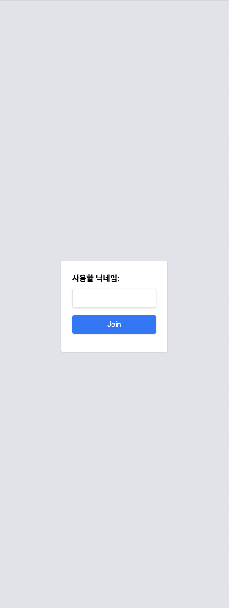
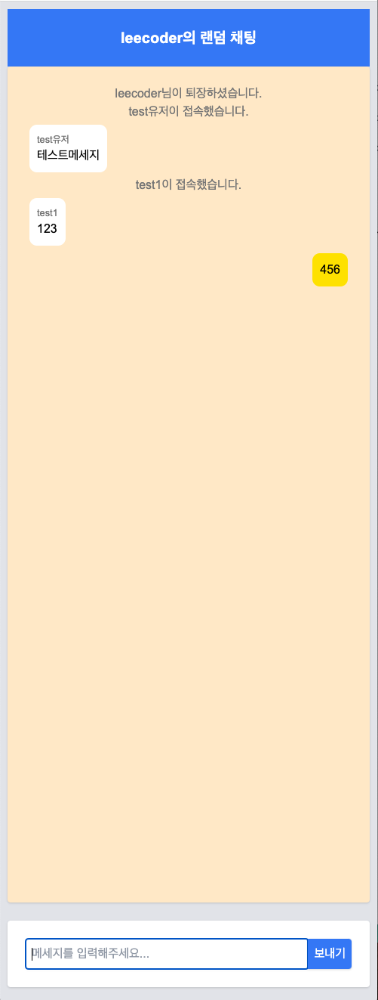

# Simple Random Chat

<p float="left">
  
   
</p>

## 설명

이 프로젝트는 Socket.io를 사용한 랜덤 채팅 애플리케이션입니다. 사용자들은 애플리케이션에 접속하여 랜덤한 다른 사용자와 채팅을 할 수 있습니다. 이 프로젝트는 NestJS 프레임워크를 사용하여 작성되었으며, 실시간 통신 기능을 제공하기 위해 Socket.io를 사용하였습니다.

## 실행
``` shell
git clone git@github.com:leecoder5359/random-chat.git 
```
### dev
``` shell
npm run start:dev
```
- 실행시 .env 생성 필요 예시
```
POSTGRES_HOST=localhost
POSTGRES_PORT=5432
POSTGRES_DATABASE=random_chat
POSTGRES_USERNAME=postgres
POSTGRES_PASSWORD=postgres
STAGE=local
```

### docker-compose
``` shell
docker-compose up --build -d
```

### DB 로컬 docker 실행
```
docker-compose -f postgres.yml up --build -d
```


## 기술 스택
- Typescript 4.9.5
- Node.js 18.18.0
- NestJS 10.2.1
- Postgres 14.6
- Docker
- Git, Github